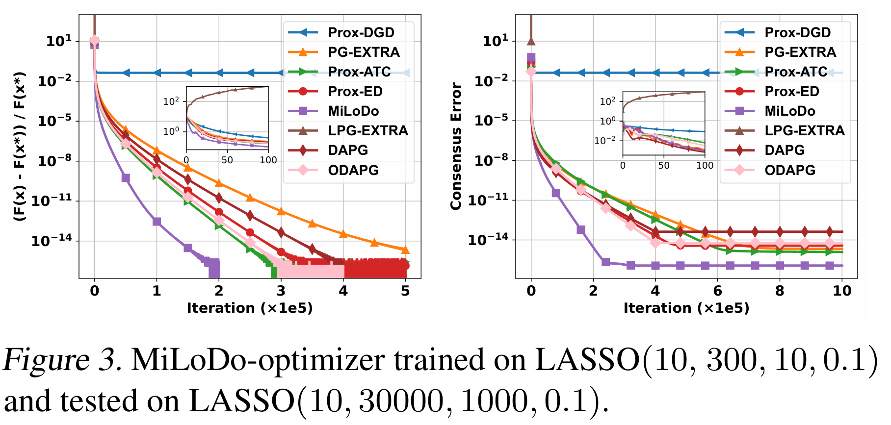
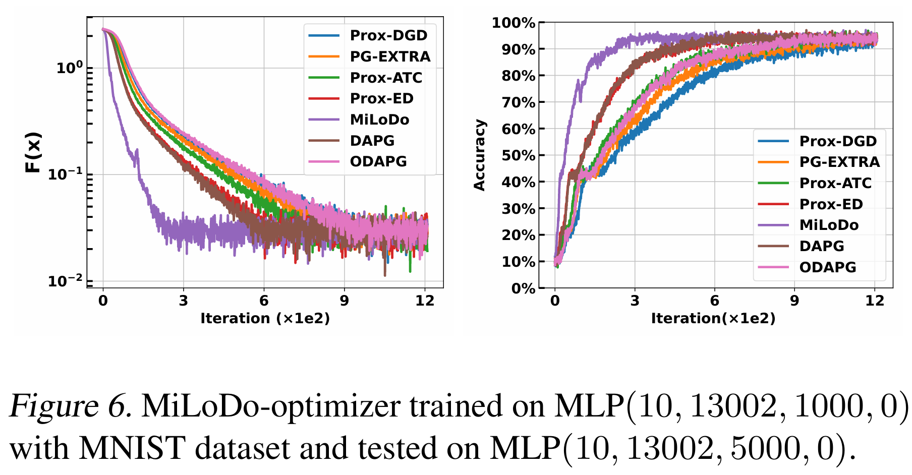
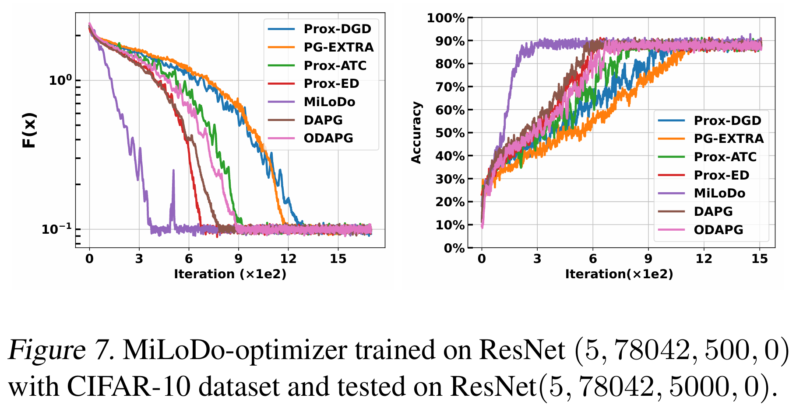
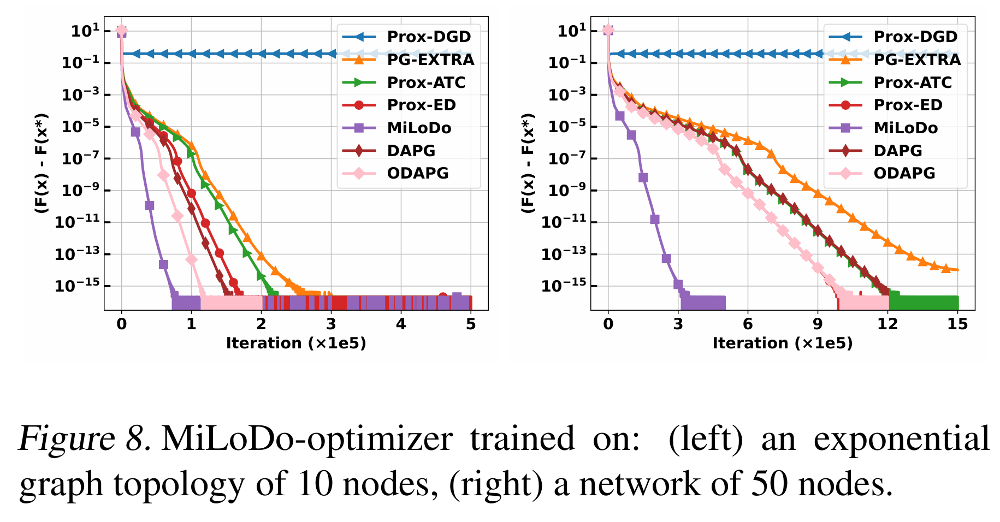

<p align="center">
  
</p>

# MiLoDo: A Mathematics-Inspired Learning-to-Optimize Framework for Decentralized Optimization

MiLoDo addresses fundamental limitations in decentralized optimization by introducing mathematical structures into learning-to-optimize approaches. Unlike traditional handcrafted algorithms with strong theoretical guarantees but sub-optimal practical performance, MiLoDo derives precise mathematical conditions that successful algorithms must satisfy, significantly narrowing the parameter search space while ensuring node consensus and strong generalization. This mathematics-guided approach enables MiLoDo-trained optimizers to consistently outperform state-of-the-art alternatives across diverse optimization tasks, from low to high dimensions and synthetic to real data. For complete technical details, see our [arXiv paper](https://arxiv.org/abs/2410.01700).

## Features


- **Mathematics-Inspired Structure**: Utilizes derived mathematical principles to constrain the learning process, ensuring both consensus and optimality
- **Exceptional Generalization**: Optimizers trained on 100 iterations can robustly perform for 100,000+ iterations during inference
- **Cross-Domain Adaptability**: Successfully transfers from synthetic to real data, low to high dimensions (300 to 30,000+), and across different loss functions
- **Performance Guarantees**: Theoretically proven to converge to exact solutions with consensus across nodes
- **Comprehensive Evaluation**: Outperforms many decentralized algorithms (Prox-DGD, Prox-ED, Prox-ATC, PG-EXTRA, DAPG, ODAPG) across various tasks
- **Versatile Problem Support**: Works with LASSO regression, logistic regression, and neural network training (MLP, ResNet)
- **Scalable Architecture**: Effective across various network topologies and large-scale networks with up to 100 nodes

## Results

MiLoDo demonstrates exceptional optimization performance and strong generalization capabilities across various scenarios:

<p align="center">

  

</p>

**Figure : Dimension Scaling** - MiLoDo optimizer trained on low-dimensional (300) LASSO problems efficiently solves high-dimensional (30000) problems, achieving 1.5-2× faster convergence than state-of-the-art methods.

<p align="center">



</p>

**Figure : Neural Network Training (MLP/MNIST)** - When training 3-layer MLP networks, MiLoDo significantly accelerates both loss function convergence and test accuracy improvement, performing approximately 2× faster than traditional optimizers.

<p align="center">



</p>

**Figure : Deep Network Training (ResNet/CIFAR-10)** - MiLoDo exhibits outstanding performance in training complex ResNet architectures, reaching higher accuracy faster and demonstrating its adaptability to non-convex optimization problems.

<p align="center">



</p>

**Figure : Network Topology Adaptability** - MiLoDo performs excellently across various network topologies (left: 10-node exponential graph, right: 50-node network), with 1.5× and 3× faster convergence respectively, proving its scalability in large distributed environments.

These results validate the effectiveness of MiLoDo's mathematics-inspired design, substantially enhancing convergence speed while maintaining optimization accuracy. For complete experimental details, please refer to our [paper](https://arxiv.org/abs/2410.01700).

## Dependencies

```bash
pip install -r requirements.txt
```

## File Structure

```
MiLoDo/
├── algorithms/          # Distributed optimization algorithm implementations
├── MiLoDo/              # Core MiLoDo framework
├── optimizees/          # Optimization problem definitions
├── scripts/             # Training scripts and configurations
├── utils/               # Utility functions
├── test.py              # Testing and comparison script
└── train.py             # Training script
```

## Training Tutorial

The MiLoDo framework uses a multi-stage training strategy to achieve optimal performance, with flexible training parameters adjustable through configuration files.

### 1. Configure Training Parameters

Training parameters are defined in the `scripts/stages_config.json` file, containing multiple training stages:

```json
[
    {
        "lr": 0.0005,              
        "truncation_length": 5,   
        "iterations": 10,        
        "epochs": 20            
    },
  
]
```

Parameter meanings for each stage:
- `lr`: Adam optimizer learning rate
- `truncation_length`: Truncated backpropagation length (inner steps)
- `iterations`: Optimization iterations per batch (outer steps)
- `epochs`: Number of training epochs for the current stage

### 2. Run Training Script

Use the provided shell script to easily start training:

```bash
chmod +x scripts/run_training.sh   # Add execution permission
./scripts/run_training.sh          # Run with default parameters
```

Or directly use Python:

```bash
python train.py --stages_config "./scripts/stages_config.json" \
    --batch_size 128 \
    --agents 10 \
    --optimizee lasso \
    --features 300 \
    --l1_weight 0.1 \
    --noise 0.1 \
    --use_bias \
    --lr_init 0.03 \
    --optimizer adam \
    --weight_decay 1e-4 \
    --seed 42 \
    --save_path "./model/multi_stage_model.pth" \
    --save_intermediate
```

### 3. Main Training Parameters

- `--optimizee`: Optimization problem type (`lasso`, `logistic`, `mlp`, `resnet`)
- `--agents`: Number of agents (nodes) in the network
- `--batch_size`: Batch size for meta-training
- `--features`: Feature dimension (LASSO/Logistic regression)
- `--l1_weight`: L1 regularization weight
- `--noise`: Data noise level
- `--save_path`: Path to save the final model
- `--save_intermediate`: Save intermediate stage models

### 4. Training Output

The training process will save the model to the path specified by `--save_path`. If `--save_intermediate` is enabled, an intermediate model will be saved for each stage. Training information is saved as a JSON file (same name as the model file with the suffix `_training_info.json`).

## Testing Tutorial

The testing script (`test.py`) is used to compare the performance of MiLoDo with other decentralized optimization algorithms.

### 1. Configure Testing Parameters

Testing parameters are configured directly in the `test.py` file:

```python
# Basic settings
seed = 42
num_agents = 10

# Algorithm parameters
iterations = 100
learning_rate = 0.01

# Optimization problem type
optimizee_type = 'lasso'  # Options: 'lasso', 'logistic', 'mlp', 'resnet'

# MiLoDo model settings
load_pretrained = False
model_path = "./model/multi_stage_model.pth"
```

Main configuration items:
- `optimizee_type`: Select optimization problem type
- `iterations`: Number of iterations for comparison testing
- `learning_rate`: Learning rate for baseline algorithms
- `load_pretrained`: Whether to load a pretrained MiLoDo model
- `model_path`: Path to the pretrained model

### 2. Run Test

Run the test script directly:

```bash
python test.py
```

### 3. Test Results

The test will compare the performance of 7 decentralized optimization algorithms and generate result charts:
- MiLoDo 
- Prox-DGD
- Prox-ED
- Prox-ATC
- PG-EXTRA
- DAPG
- ODAPG

Result charts will be saved in the `./fig/` directory, with the format `{optimization_problem_type}-{number_of_nodes}agents.png`.

## Citation


```
@misc{he2024mathematicsinspiredlearningtooptimizeframeworkdecentralized,
      title={A Mathematics-Inspired Learning-to-Optimize Framework for Decentralized Optimization}, 
      author={Yutong He and Qiulin Shang and Xinmeng Huang and Jialin Liu and Kun Yuan},
      year={2024},
      eprint={2410.01700},
      archivePrefix={arXiv},
      primaryClass={math.OC},
      url={https://arxiv.org/abs/2410.01700}, 
}
```
